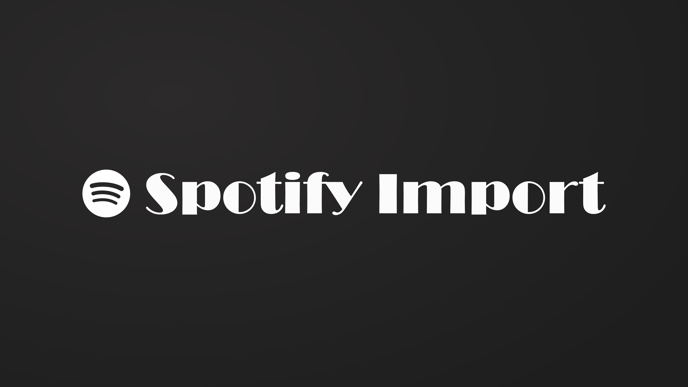

<h1 align="center">Jellyfin Spotify Import Plugin</h1>
<h3 align="center">Part of the <a href="https://jellyfin.org/">Jellyfin Project</a></h3>

<div align="center">

<br>
<br>
<a href="https://github.com/Viperinius/jellyfin-plugin-spotify-import">

</a>
<a href="https://github.com/Viperinius/jellyfin-plugin-spotify-import/releases">

</a>
</div>

## About

This plugin enables you to import playlists from Spotify to your Jellyfin server automatically. It provides a scheduled task that queries a given list of Spotify playlists and tries to recreate them as best as possible in Jellyfin.

The playlist will be created with the same name, description and image as configured in Spotify. Any matching songs that exist on your Jellyfin server will be added to this new playlist or to an already existing playlist with this name.

If desired, the plugin can create a JSON file per playlist containing a list of any missing tracks that are part of the Spotify playlist but are not present on your server.

> [!NOTE]
> The plugin is **not** a downloader for music, it only provides an automated way of importing playlist *metadata* from Spotify.

This is still work in progress, see [below](#to-do) for more details what might be coming.


## Installation

Link to the repository manifest to get the plugin to show up in your catalogue:
```
https://codeberg.org/Viperinius/jellyfin-plugins/raw/branch/master/manifest.json
```

[See the official documentation for install instructions](https://jellyfin.org/docs/general/server/plugins/index.html#installing).

## How to

### Prerequisites

To connect to Spotify, you need to be authenticated. In order to do this, the plugin needs to know a `Client ID` and will ask you for authorisation (needed for reading private or collaborative playlists and your users' liked songs).

This procedure needs a little bit of setup from your end (basically the same as described in the official [docs](https://developer.spotify.com/documentation/web-api/concepts/apps)):
1. Head over to the [Spotify Developer Dashboard](https://developer.spotify.com/dashboard) and sign in
2. Create an app (name and description do not matter really, pick whatever you want)
3. Copy the Client ID, you will need it in a second when configuring the plugin
4. Go to the `Settings` page
5. There, add a redirect URL in `Redirect URIs`. This URL is called after you grant the plugin read access to your playlists and must be the following value:\
   `https://<YOUR JELLYFIN IP OR DOMAIN>/Viperinius.Plugin.SpotifyImport/SpotifyAuthCallback`, e.g. `http://127.0.0.1:8096/Viperinius.Plugin.SpotifyImport/SpotifyAuthCallback`\
   The IP or domain must match the one you are using when configuring the plugin\
   **Note:** If you want to use the localhost loopback address, you need to specify it as `http://127.0.0.1:8096` instead of `http://localhost:8096`, see [here](https://developer.spotify.com/documentation/web-api/concepts/redirect_uri)
6. Save the settings

### Get started

After installing the plugin, visit its configuration page and add your Spotify Client ID (save afterwards) and click on `Authorize`. You will be redirected to Spotify to grant access. The plugin requests access to these scopes:
- Read private playlists
- Read collaborative playlists
- Read user library (to get "liked songs" list)

When the authorisation is done, you can continue with the plugin configuration page.

#### Add Playlist

Go to the section `Playlist Configuration` and click on `Add new playlist`. This creates a new row with these fields:
- `Spotify ID`: Paste the identifier of the Spotify playlist that you want to import in here.
- `Target Name`: Jellyfin playlist name. Keep this empty if the original name from Spotify should be used.
- `Target User`: If you want to set another user as the playlist owner, select them here.
- `Set To Private`: If you want to limit the playlist visibility to the targeted owner, check this box.
- `Always From Scratch`: If you want to delete and recreate the Jellyfin playlist on each import run, check this box.

> [!WARNING]
> If you use `Always From Scratch` for a playlist and any playlist with this name already exists on your Jellyfin server, it **will** get deleted and replaced by the Spotify playlist.

Following "Spotify ID" formats work:
- The raw ID, e.g. `4cOdK2wGLETKBW3PvgPWqT`
- The Spotify URI, e.g. `spotify:playlist:4cOdK2wGLETKBW3PvgPWqT`
- The full Spotify playlist URL, e.g. `https://open.spotify.com/playlist/4cOdK2wGLETKBW3PvgPWqT`

#### Follow User

If you just want to import all playlists of a Spotify user, go to `Users Configuration` and click `Add new user`.
- `Spotify ID`: Paste the identifier of the Spotify user that you want to import in here.
- `Target User`: If you want to set another user as the playlist owner, select them here.
- `Set To Private`: If you want to limit the playlist visibility to the targeted owner, check this box.
- `Only Original Playlists`: If you want to follow all playlists of a user, including collaborative ones, leave this unchecked. If you only want to follow the playlists that the user created, check this box.

The following "Spotify ID" formats work:
- The raw ID, e.g. `acooluser`
- The Spotify URI, e.g. `spotify:user:acooluser`
- The full Spotify user URL, e.g. `https://open.spotify.com/user/acooluser`

Afterwards, following runs of the import task will include all playlists of this user and map them to the configured Jellyfin user.

> [!NOTE]
> It is currently not possible to rename the playlists. Nor is it possible to selectively import only some of the playlists of a user without specifying each targeted playlist as described in [Add Playlist](#add-playlist).
> The `Always From Scratch` option available for individual playlists is also not used here currently.

> [!IMPORTANT]
> Since 27th November 2024 any playlists owned / created by Spotify (e.g. `Release Radar`) are no longer accessible using the normal authentication method (client ID + authorisation). The plugin uses a workaround to still be able to import those playlists, but with a caveat:
> If you want to import such playlists through the `User Configuration`, a Spotify web session cookie needs to be set in the plugin settings, see [below](#setting-spotify-cookie).

#### Liked Songs

You can also import your "liked songs" section as a playlist, but only for the user that was used to create the Spotify authentication token for the plugin. To do this, simply add a new playlist with the following ID as described in [Add Playlist](#add-playlist):
```
MyLikedSongs
```

> [!NOTE]
> If you've used this plugin prior to version 1.14.0.0, you need to re-authorise in the plugin settings. Otherwise you will see an error in your logs if you try to import liked songs. This happens because the authentication token created by previous versions did not request the right to read the Spotify user library yet.

#### Setting Spotify Cookie

To configure a Spotify session cookie as authentication fallback, follow these steps:

1. Open the [Spotify web client](https://open.spotify.com/) and sign in
2. Open the developer tools of your browser by pressing F12
3. Depending on your browser, go to the section listing current cookies:
    - Firefox: Tab `Storage`, then expand the `Cookies` section on the left and click on the entry for `https://open.spotify.com`
    - Chrome / Edge: Tab `Application`, then expand the `Cookies` section on the left and click on the entry for `https://open.spotify.com`
4. You should see a cookie with the name `sp_dc` (if not, make sure you are logged in), copy its `Value` entry
5. Paste it in the field `Spotify Session Cookie` of the plugin configuration page

#### Save Changes

When done, save these settings and you're set. The plugin will do its thing periodically (default: daily at 03:00).
If you want to change this or want to let it run immediately, head to the scheduled tasks page and look for the task `Import Spotify playlists`.

### Track match tweaking

#### Raw name matching

By default, the plugin will accept a Jellyfin track as equal to a Spotify track if these conditions are met:
- Same track name
- Same album name
- At least one album artist of the Jellyfin and Spotify album artist lists match
- At least one artist of the Jellyfin and Spotify artist lists match

If you experience issues with tracks not matching even if they exist, you can "relax" these settings:

1. `Match Type` determines how strict the individual comparison is (e.g. if case differences or diacritics are ignored)
2. `Enable * comparison` fully enables or disables the comparison of the respective condition

`Match Type` allows selecting `Fuzzy Check` which adds another less strict matching option for track and album names (but not artists).
When selected and if no other type already provides a match, a name will be matched if both strings are `x` modifications apart from each other. `x` refers to the number configured in `Max. Accepted Character Differences In Match`.

Example with max. differences set to 2:
| Provider name | Jellyfin name | Is Match |
| -- | -- | -- |
| abcde | abcde | &check; |
| abcd | abcd | &check; |
| Aabde | abcde | &check; |
| Aabd | abcde | &cross; |

#### MusicBrainz matching

If you use MusicBrainz as metadata provider on the server, you can enable an additional method of finding matches. In the configuration section `Additional matching methods` enable the option for `MusicBrainz IDs and the track ISRC`.
With this enabled, this method will be checked before falling back to the default "raw name matching". This matcher tries to find the correct Jellyfin track using the respective MusicBrainz IDs for it.
Such a match will be accepted regardless of any differences in track title etc.
> Note: For this to work, the track obviously has to be part of the MusicBrainz database and also has to have its ISRC (a global identifier for a recording) set. The ISRC is used to find the correct MusicBrainz item for a Spotify track.

After enabling this method (and especially if you try to import multiple thousands of tracks), the next import might take a bit longer because the plugin will build an internal cache for ISRC <-> MusicBrainz ID relationships. If a track is not found based on its ISRC, the plugin will try again after a few weeks to check if it got added to the MusicBrainz database.

### Track match forcing

If you have a track with a name wildly different to its equivalent on Spotify or it's not covered by the existing track matching for other reasons, you can define a "manual mapping entry" for this track. If a given Spotify track in this map is part of a playlist, it will always get matched with the defined Jellyfin track.

Defining an entry can be done via a page on the Jellyfin admin dashboard (at the bottom of the admin panel plugin section you can go to `Spotify Import - Map`). Add a new row there and fill it with the Spotify track information as well as the targeted Jellyfin track ID. To get that ID, navigate to the track in the web UI and paste in its link or click the three dots of it, click on `Copy Stream URI` and paste that into the `Jellyfin Track` field. After parsing the link (click the check mark), you should see the track name instead.
When done adding rows, save the map.

> [!TIP]
> To specify multiple artists for a track, use a comma to separate them.

Alternatively, you can change the manual map file `manual_track_map.json` directly. It is located in the plugin directory (if you need help finding it, check the Jellyfin logs at startup for the string `Path to manual track map`).


## Troubleshooting

If you encounter issues with playlists / tracks not matching when they definitely should, you can enable the logging of some more information from the playlist importer.

Check `Enable verbose logging for this plugin.` in the plugin settings.
With this, things like the Spotify API calls are logged and you will see log entries for every track that did not get matched and added to a playlist.


## To do

A few things that are not implemented yet:

- Allow (optional) synchronisation by also removing items that are not present in the Spotify playlist
- Keep order of tracks synchronised with Spotify
- Allow renaming and deselecting single playlists when synchronising all user playlists
